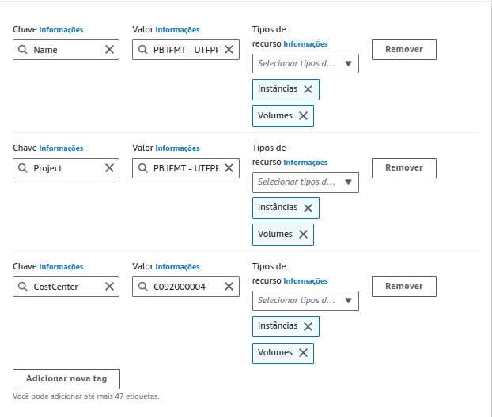
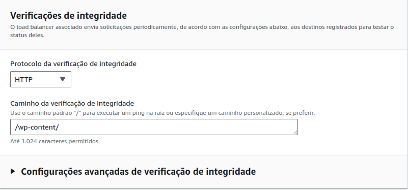
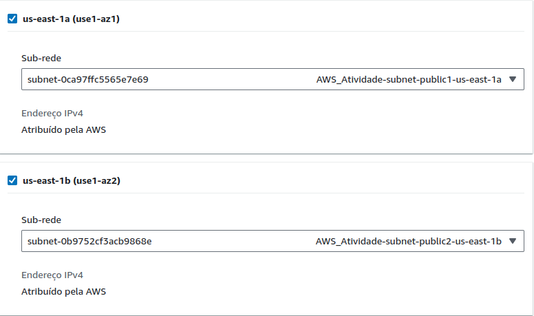
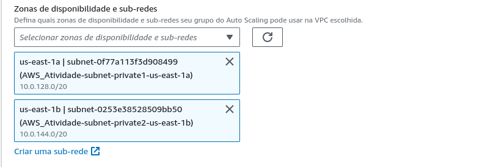
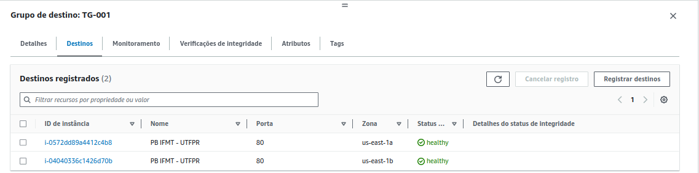
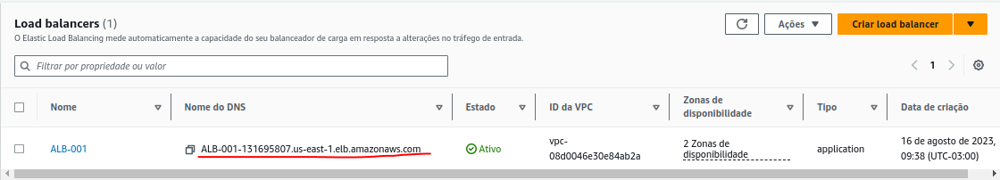
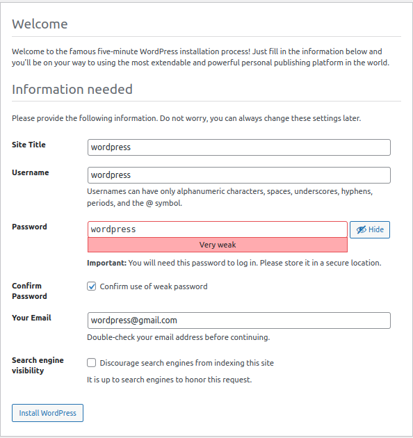
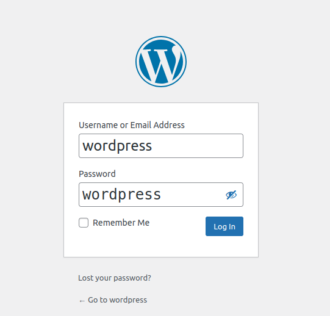
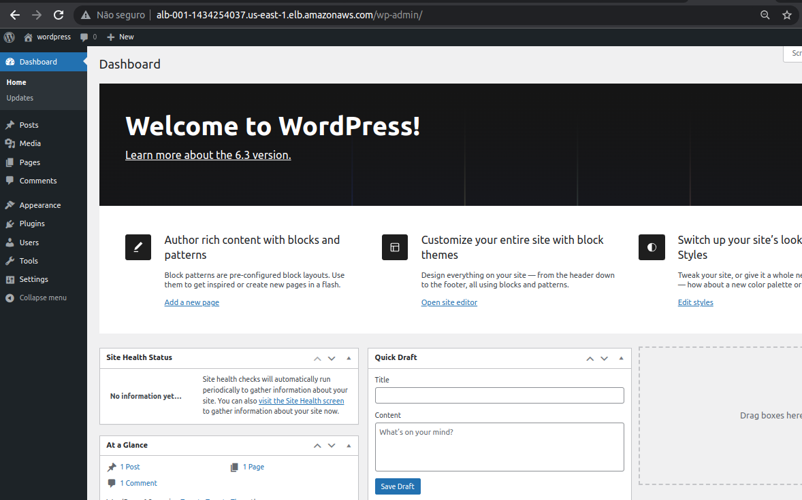
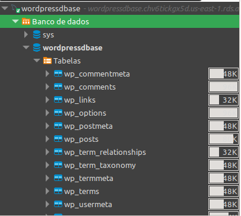

# _Atividade sobre Docker na AWS_

### Criando um arquivo .sh
Antes de começar a configuração dentro da AWS, primeiro vamos criar um arquivo de ShellScript para a instalação automática no **user_data** dentro das instâncias EC2

Para isso, vamos criar um arquivo chamado **update.sh** e colocar as seguintes configurações:
```sh
#!/bin/bash

yum update -y
yum install -y docker
systemctl start docker.service
systemctl enable docker.service
echo "$(systemctl status docker.service)" > /tmp/log_docker.txt
usermod -aG docker ec2-user

curl -L https://github.com/docker/compose/releases/latest/download/docker-compose-$(uname -s)-$(uname -m) -o /usr/local/bin/docker-compose

chmod +x /usr/local/bin/docker-compose
echo "$(docker-compose version)" >> /tmp/log_docker.txt
```
Basicamente, esse arquivo vai instalar o docker e o docker-compose (últimas versões) dentro da nossa instância EC2, anotando os logs de instalação dentro de um arquivo chamado **log_docker.txt** localizado no diretório **/tmp**

## Criando uma VPC

Antes de executar uma instância, precisamos criar e configurar uma VPC, onde nela teremos:
- 2 subnet pública 
- 2 subnets privadas


Para criar um nova VPC, vamos:
- Ir nos serviços de VPC dentro da AWS
- Ir em _Suas vpcs_ e depois em Criar VPC_
- Selecionar a opção **VPC e muito mais**
- Vamos deixar tudo padrão (2 AZs, 2 subnets públicas e 2 subnets privadas)
- Depois vamos em _Criar VPC_

## Criando um Security group na VPC criada

Após a criação da VPC, vamos criar um security groups no qual usaremos nas **instâncias e no EFS**

Vamos na seção **Rede e segurança** dentro dos serviços de EC2 e selecionar **Security groups**
- Vamos criar um novo security group
- Vamos Atribuir o nome **Docker_wordpress**, uma descrição, e selecionar a VPC criada.
- Em regras de entrada, vamos criar as seguintes permissões:
  - **Tipo:** SSH | **porta:** 22 | **Origem:** Meu Ip
  - **Tipo:** http | **porta:** 80 | **Origem:** Qualquer IPv4 (0.0.0.0/0)
  - **Tipo:** https | **porta:** 443 | **Origem:** Qualquer IPv4 (0.0.0.0/0)
  - **Tipo:** MYSQL/Aurora | **porta:** 3306 | **Origem:** sg-(Security Group do RDS)
  - **Tipo:** NFS | **porta:** 22 | **Origem:** sg-(security Group Docker_wordpress) 

A configuração do Security group irá permitir o acesso SSH apenas para o nosso ip (podemos configurar outra liberação caso haja a necessidade de um Bastion host), o acesso http e https para qualquer IPv4 (isso é necessário para a configuração do Load Balancer posteriormente), o acesso do MySql apenas para o banco de dados que tiver o security group em específico anexado (nesse caso, vamos configurar o security group que criaremos quando formos configurar o RDS), e o NFS apenas para os recursos que compartilham o mesmo Security group, nesse caso: a Instância e o EFS (mais seguro).

Como ainda não criamos o Banco de Dados RDS e consequentemente o grupo de segurança, a configuração da regra de saída **MYSQL/Aurora** iremos configurar posteriormente. 

A regra de saída do NFS, por usar o grupo de segurança que estamos criando, não é possível criá-lo de imediato. Primeiro precisamos criar o grupo de segurança, e depois editar as regras de entrada, atribuindo a regra do tipo NFS para a origem do grupo de segurança em questão.

## Criando um banco de dados RDS

Para podermos criar a aplicação wordpress, precisamos de um banco de dados configurado, onde faremos isso nos serviços de **RDS** dentro da aws

Passo-à-Passo:
- Clicar em Criar banco de dados
- Selecionar o DB **MySql** e depois selecionar "Nível gratuito" ou "Free tier"
- Em Identificador da instância de banco de dados vamos colocar **wordpress** 
- Em Nome do usuário principal vamos colocar **root**
- Como senha principal, também vamos colocar **wordpress** (não recomendado para ambientes de produção)
- Em Configuração da instância vamos deixar como db.t3.micro (dentro do free tier)
- Em Armazenamento, vamos deixar o tamanho por padrão e desabilitar o "Habilitar escalabilidade automática do armazenamento"
- Em Conectividade, vamos selecionar a opção "Não se conectar a um recurso de computação do EC2", escolher a VPC criada anteriormente, o Acesso público vamos deixar como sim (apenas para essa atividade, porém pode haver a necessidade em um ambiente de produção desabilitar o acesso público), e por fim vamos criar um novo grupo de segurança chamado **"RDS_MySql"**
- Em configurações adicionais, vamos colocar **wordpress** como nome do banco de dados inicial, desabilitar "backups automatizados" e "criptografia".
- Após isso, podemos criar nosso banco de dados

O processo de criação pode levar um tempinho.
Após criado, é importante que anotemos o **Endpoint** do nosso banco de dados, será importante para acessarmos ela

## Configurações adicionais do Security groups

Agora que criamos o Banco de Dados no RDS, vamos realizar algumas configurações finais nos grupos de segurança criados.
- Grupo de segurança **RDS_MySql**
  - Vamos adicionar mais uma regra do tipo MYSQL/Aurora
  - Em destinos, vamos adicionar o grupo de segurança do Docker_wordpress 
- Grupo de segurança **Docker_wordpress**
  - Vamos adicionar mais uma regra do tipo MYSQL/Aurora
  - Em destinos, vamos adicionar o grupo de segurança do RDS_MySql (igual na instrução acima)

## Testando nosso banco de dados

Como colocamos nosso banco de dados para acesso público, podemos testá-lo para saber se está funcionando corretamente, usando programas como o **dbeaver-ce** ou outro de sua preferência.
Para testar, precisamos criar uma nova conexão, selecionar o MySql, e colocar as informações do banco de dados: o Endpoint em "server host", a porta, o nome do banco de dados, usuário, e a senha.

Vale ressaltar novamente que o RDS foi configurado como público apenas para fins de estudos, mas dependendo de sua aplicação, é mais seguro deixar sem o acesso público

## Criando a primeira instância

Agora, dentro da console da AWS, vamos criar uma nova instância seguindo os mesmos passos da **Atividade_1**. A diferença, é que vamos anexar o arquivo update.sh no **user_data** em opções avançadas, e, nesse primeiro momento, vamos habilitar a atribuição automática de ipv4 público à instância, para que possamos acessá-la via ssh sem a necessidade de atribuir um Elastic IP

## montagem do EFS

Vamos no serviço de EFS dentro da console da amazon (criada na Atividade_1), e, dessa vez, vamos efetuar uma montagem permanente da EC2.
Uma vez conectado a instância, vamos executar o seguinte comando:
```sh
sudo vim /etc/fstab
```
O arquivo **fstab** gerência como e onde as partições e dispositivos de armazenamento devem ser montados, e vamos usar para montar de forma permanente o EFS da aws.
Para isso, devemos adicionar a seguinte instrução no arquivo:
```sh
<mount-target-DNS:/> <efs-mount-point> nfs4 <options> 0 0
```
Onde:
- **mount-target-DNS**: DNS do seu efs
  - Ex: fs-06fbc125e54a40e59.efs.us-east-1.amazonaws.com:/
- **efs-mount-point**: é o ponto de montagem
  - Ex: /home/ec2-user/efs/
- **options**: as opções de montagem
  - ex: nfsvers=4.1,rsize=1048576,wsize=1048576,hard,timeo=600,retrans=2,noresvport 0 0

Após isso, vamos criar o diretório efs com o comando **mkdir efs** dentro do diretório do usuário, e então podemos usar o comando **sudo mount -a** para montar o efs sem a necessidade de reiniciar a máquina, e podemos executar o comando **df -h** para visualizarmos o ponto de montagem criado.

Para evitar problemas com questões de permissão, para essa atividade, vamos executar o seguinte comando para permitir a leitura/gravação do usuário ec2-user:
```sh
sudo chown ec2-user efs/
```
Se executarmos o comando **ls -la** veremos que agora o usuário _ec2-user_ é o dono desse diretório

## Arquivo docker-compose e configuração do wordpress

Uma vez montado, podemos entrar no diretório compartilhado (cd efs/) e criar um arquivo de configuração do docker-compose para subir uma aplicação wordpress.
Vamos executar o comando **vim docker-compose.yml** exatamente dessa forma, e criaremos o seguinte código:

```yml
version: "3.8"
services:
  wordpress:
    image: wordpress:latest
    volumes:
      - ./config/php.conf.uploads.ini:/usr/local/etc/php/conf.d/uploads.ini
      - ./wp-app:/var/www/html
    ports:
      - 80:80
    restart: always
    environment:
      - WORDPRESS_DB_HOST=endpoint
      - WORDPRESS_DB_USER=root
      - WORDPRESS_DB_PASSWORD=wordpress
      - WORDPRESS_DB_NAME=wordpress
```
Esse código irá baixar a imagem **wordpress**, anexar o volume efs como diretório estático dentro do container wordpress, e definir a porta 80 para expor a nossa aplicação.
As variáveis de ambiente (environment) permitirão que o wordpress acesse o banco de dados, e para isso, a única coisa que precisamos mudar quando formos configurar esse código, é o **WORDPRESS_DB_HOST**, onde colocaremos o endpoint do RDS criado anteriormente

Após criar o arquivo de configuração do docker, vamos executar o seguinte comando:
```sh
docker-compose up -d
```
Esse comando irá executar o arquivo do docker compose, criando os diretórios **config** e **wp-app** contendo os arquivos de configurações do wordpress dentro do NFS, e criando nossa aplicação.  

Uma vez criado, a aplicação do wordpress estará rodando sem interrupções dentro do serviços de EFS. Ou seja, toda instância que tiver o EFS que montado, poderá ser usado para acessar nossa aplicação, facilitando quando formos trabalhar com o Load Balancer (não haverá também a necessidade de executar o comando "docker-compose up" toda vez que uma instância nova for criada)

A flag -d é usada para iniciar os serviços definidos no arquivo docker-compose.yml em segundo plano (modo detached). Porém, podemos acessar os logs do nosso container, com o seguinte comando:

```sh
docker logs <hash_container>
```
Para visualizarmos o hash do container, podemos executar o comando **docker ps**. 

Depois disso, podemos desconectar dessa instância. 

## Criando um template

Quando formos trabalhar com Auto scaling, teremos que utilizar uma **instância modelo** para o _scaling out_ (ajusta sua capacidade horizontalmente), ou seja, criando novas instâncias com base no **modelo de execução**.
Para isso, primeiro vamos gerar uma **AMI** da instância que acabamos de criar:
- Selecionar a instância criada
- Ir em **ações** 
- Selecionar **imagem e modelos** e depois **criar imagem**
- Atribuir um nome (Wordpres) e uma descrição

Após isso, na seção **instâncias**, vamos em _modelo de execução_ e criar um novo modelo de execução que usaremos no Auto Scaling. Para isso, vamos:
- Atribuir um nome (Wordpress) e uma descrição
- Em **AMIs**, vamos clicar em "Procurar mais AMIs" e então selecionar a AMI criada anteriormente.
- Tipo de instância vamos colocar **t2.small**
- Em pares de chaves, vamos selecionar a Chave que criamos na atividade_1 caso precise realizar um Bastion host
- **[IMPORTANTE]:** Em configurações de rede, vamos selecionar o Grupo de segurança que criamos anteriormente (Docker_wordpress), e em sub-rede, vamos deixar a opção "Não incluir no modelo de execução" (a sub-rede será definida quando formos criar o Auto Scaling).
- **[IMPORTANTE]:** Em tags de recursos, é importante colocar as mesmas tags que colocamos na instância, para termos acesso na hora de criar um Auto Scaling:
  - **Chave:** Name | **Valor:** PB IFMT - UTFPR | **Tipos de recursos:** anexar instâncias e Volumes
  - **Chave:** Project | **Valor:** PB IFMT - UTFPR | **Tipos de recursos:** anexar instâncias e Volumes
  - **Chave:** CostCenter | **Valor:** C092000004 | **Tipos de recursos:** anexar instâncias e Volumes
- Após isso, vamos criar nosso modelo de execução



## Criando um Load Balancer

Antes de criarmos um Auto scaling, vamos configurar o nosso Load Balancer para prover o balanceamento de carga entre as instâncias.
Para isso, primeiro vamos criar o Target Group:
- Na seção **Balanceamento de carga** nos serviços de EC2, vamos selecionar a opção **Grupos de destinos** e depois **Criar grupos de destinos**.
- Vamos selecionar "instâncias", criar um nome para o nosso target group (TG-001), o protocolo http na porta 80 deixaremos como padrão e vamos selecionar a vpc criada anteriormente para essa atividade.
- Para evitar que haja um erro de redirecionamento (302) e faça com que as instâncias fiquem como "unhealthy", em **Verificações de integridade**, vamos colocar no **Caminho da verificação de integridade** o diretório **/wp-content/**. 

- **[IMPORTANTE]**: nesse primeiro momento, não vamos selecionar nenhuma instância como dependência do target group, vamos apenas criá-la

Uma vez criado o Target group, vamos criar o nosso Load Balancer:
- Ainda na seção **Balanceamento de carga** vamos selecionar a opção **Load Balancers** e depois Criar load balancer.
- Vamos selecionar o Application Load Balancer (aplicações com tráfego HTTP e HTTPS)
- Vamos atribuir um nome para o nosso Load Balancer (ALB-001).
- Deixaremos ele voltado para a internet, e apenas com IPv4 configurado.
- Em mapeamento de rede, vamos selecionar nossa VPC criada anteriormente e selecionar as zonas de disponibilidade que configuramos dentro da VPC (que nesse caso, são duas).
  - **[IMPORTANTE]:** após selecionar as zonas de disponibilidade, vamos selecionar as sub-redes **públicas** de cada AZ, caso o contrário nossa aplicação não irá funcionar da maneira esperada

- Vamos selecionar o Grupo de Segurança que criamos anteriormente (Docker_wordpress).
- em Listeners e roteamento vamos selecionar o Target group que criamos anteriormente (TG-001), e deixaremos a porta padrão (http - 80)
- Após isso, poderemos criar o nosso Load Balancer

## Criando o Auto Scaling

Após criar o Load Balancer, vamos criar o Auto Scaling Group para prover o escalonamento da nossa aplicação.

Para isso, vamos:
- Ir na seção **Auto Scaling** nos serviços EC2, e clicar em **Grupos Auto Scaling** e depois em **Criar Grupos do Auto Scaling**
- Vamos atribuir um nome (ASG-001) e selecionar o modelo de execução que criamos anteriormente (Wordpress) 
- **[IMPORTANTE]:** em rede, vamos selecionar a VPC criada anteriormente, e em **Zonas de disponibilidade e sub-redes** vamos selecionar APENAS as sub-redes privadas, para que as instâncias que forem criadas pelo Auto Scaling a partir do template, sejam criadas sem a possibilidade de serem acessadas publicamente - ou seja, serão instâncias privadas, na qual só teremos acesso via Bastion host ou pelo tráfego do Load Balancer.

- Em **Balanceamento de carga**, vamos selecionar a opção **Anexar a um balanceador de carga existente** e selecionar o Target Group que criamos (as instâncias serão criadas e anexadas automaticamente ao Load Balancer), e o restante deixaremos como padrão.
- Em **Tamanho do grupo**, vamos colocar da seguinte forma:
  - Capacidade desejada: 2
  - Capacidade mínima: 1 
  - Capacidade máxima: 3 
- Temos a possibilidade de criar uma Políticas de escalabilidade, porém vamos pular essa parte.
- Podemos adicionar uma notificação pelo SNS e criar etiquetas, porém vamos pular essas etapas também e criar o Auto Scaling

Após criado, duas instâncias serão criadas, ambas em uma sub-rede privada. Após a criação, o Target Group irá verificar se as instâncias estão rodando conforme o esperado. Caso esteja, os status das instâncias serão healthy e o Load balancer estará pronto para ser usado.


## Configuração do Wordpress

Para acessarmos nossa aplicação, vamos no Load Balancer que criamos, e copiar o **Nome de DNS Completo**, e então abrir no navegador. 



Uma vez acessado, teremos a tela de idiomas, no qual escolheremos _inglês_. 

Ao prosseguir, seremos encaminhados para a tela de boas vindas, na qual precisamos efetuar a instalação do wordpress. Para isso, colocaremos "wordpress" em todos os campos disponíveis (porém isso não é obrigatório) e então daremos continuidade a instalação.



Após a instalação, teremos uma tela de sucesso, nos permitindo realizar o login dentro da aplicação do wordpress:



Após efetuar o login, teremos acesso a nossa aplicação wordpress como admin:



## Visualizando mudanças no Dbeaver-ce

Após a instalação do Wordpress, podemos visualizar as tabelas criadas dentro do banco de dados do RDS através do Dbeaver-ce ou outro programa de sua preferência



Lembrando que, para visualizá-lá, precisamos tornar o banco de dados público, porém por questões de segurança, é recomendado reavaliar se há a necessidade de um banco de dados público. Nessa atividade foi criada apenas para melhor visualização, além de apresentar uma ferramenta de gerência mento de banco de dados.