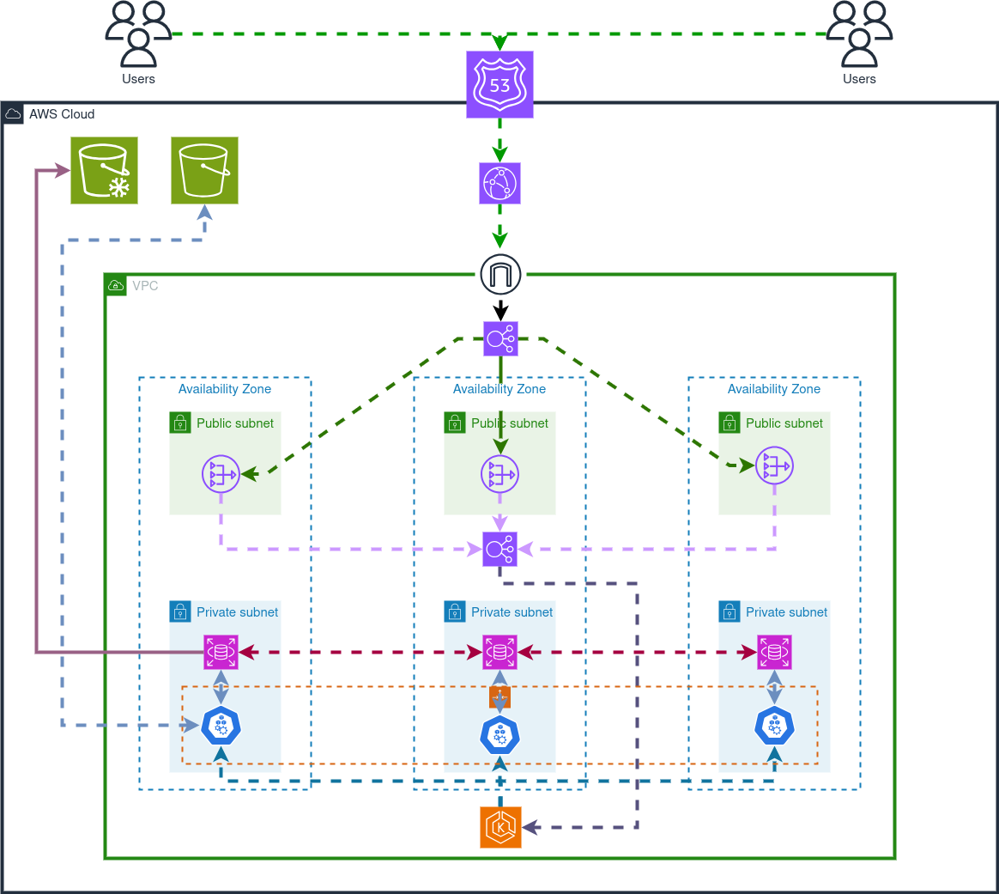

# Projeto de Migração eCommerc para AWS

Este projeto documenta o processo de migração de um eCommerc para a nuvem Amazon Web Services (AWS). Diante de um aumento constante de 20% no tráfego mensal, a empresa decidimu migrar a infraestrutura para AWS, aproveitando os principais serviços para criar um ambiente escalável e confiável.

## Visão Geral
Nosso projeto consiste na criação de um ambiente hospedado em AWS para e-commerce, utilizando React como servidor web, servidor para conteúdo estático e banco de dados MySQL. Para garantir alta disponibilidade e escalabilidade, implementamos a infraestrutura em Kubernetes. Aqui está uma lista dos principais que eu e meu grupo utilizamos:

- **Kubernetes**: Para orquestração de contêineres e escalabilidade automática.
- **Application Load Balancer**: Distribuição de tráfego entre os nodes do Kubernetes.
- **Route53**: Gerenciamento de DNS para roteamento de tráfego.
- **CloudFront**: CDN para distribuição eficiente de conteúdo estático.
- **NAT Gateway**: Permite que os recursos privados na VPC acessem a Internet.
- **RDS com MySQL**: Banco de dados relacional gerenciado para armazenamento de dados.
- **VPC**: Rede Virtual Privada para isolamento e segurança dos recursos.
- **S3 Standard e Glacier**: Armazenamento seguro e econômico para dados estáticos e backups.
- **AWS DMS**: Serviço de migração de banco de dados para facilitar a transição de dados.
- **AWS KMS**: Gerenciamento de chaves de criptografia para garantir a segurança dos dados.
- **AWS Cognito**: Serviço de autenticação e autorização para usuários.
- **AWS Backup**: Solução de backup automatizada para dados críticos.
- **CloudWatch**: Monitoramento e logging para garantir a performance e a integridade do sistema.
- **Permissões de Roles**: Gerenciamento granular de permissões para recursos AWS.

Além disso, planejamos também utilizar o serviço **AWS Compute Optimizer** para otimização contínua dos recursos de computação, garantindo eficiência e economia.

## Planejamento de Custos dos nossos serviços
Para garantir um planejamento financeiro sólido, adotamos um modelo de custos baseado em sprints de 2 semanas, totalizando 10 sprints. A carga de trabalho é de 8 horas por dia, a uma taxa de 6 dólares por hora. Este modelo nos proporciona uma visão clara dos custos operacionais ao longo do projeto.

## Principais passos
- **Configuração e Implantação no Kubernetes**: Implementar o ambiente no Kubernetes, garantindo a escalabilidade e a confiabilidade necessárias.
- **Configuração do AWS Compute Optimizer**: Ajustar continuamente os recursos de computação para otimização de custos e desempenho.
- **Migração de Dados com AWS DMS**: Facilitar a migração de dados do ambiente anterior para o novo ambiente na AWS.
- **Configuração de Segurança com AWS KMS e Cognito**: Garantir a segurança dos dados e implementar autenticação e autorização eficientes.
- **Implementação do AWS Backup**: Configurar políticas de backup para proteger dados cruciais contra perdas.
- **Monitoramento e Otimização Contínua**: Implementar monitoramento com CloudWatch e ajustar a infraestrutura conforme necessário para garantir eficiência e escalabilidade contínuas.
